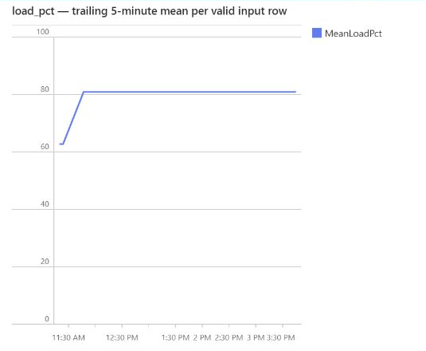
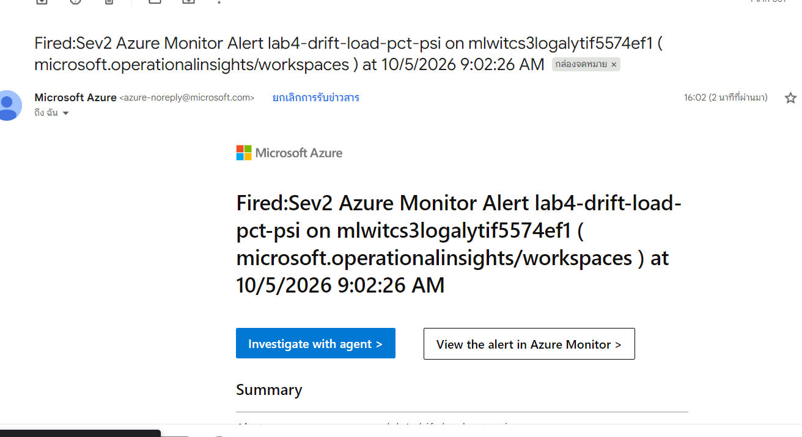
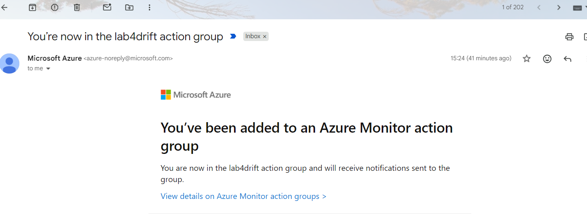

# Lab 4 Evidence

## Task 1 — Tests that can actually fail

I reused the Lab 3 serving code and the existing dataset. I added tests without training a new model.

- **Unit tests:** check that feature values and column order stay correct. A missing feature must fail before reaching the model. These tests use a mock and run offline.
- **Data tests:** check the dataset contracts below. I also kept the split tests, including the check that no machine appears across train, validation and test sets.
- **Model behaviour tests:** load `models:/itcs355-u6688124/1` and check valid probabilities, a low-risk prediction for the instructor’s healthy-machine example, and prediction latency.
- **Integration test:** start the built container, wait for `/ready`, then call `/predict`. It must return HTTP `200`, a probability between 0 and 1, and model version `"1"` in both the JSON body and response header.

### What the data contracts would catch

These are examples of problems the tests would catch, not incidents observed in production.

| Data contract | Problem it would catch |
|---|---|
| Expected columns and types | An upstream export drops `temp_c`, adds an unexpected column, or changes a column’s type. |
| No nulls in required columns — allowed null rate: 0% | A failed sensor or incomplete join leaves missing feature values. |
| Features stay within plausible ranges | A producer sends an impossible value, such as `load_pct = 250`. |
| Labels are 0/1, with positive rate strictly between 1% and 99% | A label export uses `2` for failures or accidentally writes every label as `0`. |
| Unique `reading_id` | An ingestion retry adds the same readings twice. |

I tested eight deliberately corrupted copies to confirm that the contract checks reject bad data. The original CSV was not changed. These are local checks, not the failing-PR evidence required in Task 3.

### Checks

Local checks used the existing Lab 3 Python environment. Registry-backed tests also required serving configuration and cloud login.

- **20 offline tests passed**, including the leakage test and eight bad-data cases.
- **3 model behaviour tests passed.** The healthy-machine example scored `0.0`. Mean warm prediction time was `33.349 ms`, below the `200 ms` limit.
- **1 integration test passed** using `itcs355-lab4:task14-local-20260929`.
- `make portability-audit` passed.

The latency limit reuses Lab 3’s target as a loose model-only check. It measures mean warm inference time, not API p95.

### Problem and fix

The local container does not share my host’s cloud login. I passed a short-lived token through stdin without putting it in the image or Git. This setup is for the local test; it does not establish CI authentication.

The test removed its container afterwards. The registered model and original training run stayed unchanged.

## Task 2 — CI pipeline

I added a GitHub Actions workflow for pull requests and pushes to main. It scans the full Git history, runs lint and tests, builds the image, then tests that image before publishing it.

Only a successful run on main can push the image to ACR and deploy to staging. The image uses the commit SHA as its tag and is deployed by digest. Azure login uses OIDC instead of a saved cloud password.

### Checks

[CI run for commit `bb38fe7`](https://github.com/nithit-cypherX/mlops-engineering/actions/runs/36961138955) passed:

- Secret scan, lint and portability audit passed.
- 166 unit/data tests, 3 model behaviour tests and 1 integration test passed.
- Staging used the digest pushed by this run. All three smoke payloads passed with model version `"1"`.
- Cleanup removed the runner’s temporary IP rule. I checked Azure again and confirmed that only my configured IP remained allowed.

### Problems and fixes

The readiness check depended on `latestReadyRevisionName`, which Azure did not return. I changed it to check the revision directly, including its image digest and model version, and gave CI permission to read revisions.

CI also hit a GET timeout. The code now retries readiness GETs within the same 600-second limit without deploying again. The cause of the earlier slow GET is still unknown.

Cleanup had another problem: Azure accepted the PATCH but returned an empty response, which caused a JSON error. I handled the empty response and kept the GET check that confirms the runner’s IP rule was removed.

## Task 3 — Prove a bad commit is blocked

I opened [PR #1](https://github.com/nithit-cypherX/mlops-engineering/pull/1) with one deliberate change: the data loader returned `load_pct=250`, above the allowed maximum of `100`. I kept the original CSV and tests unchanged.

### Checks

[CI run for commit `7896619`](https://github.com/nithit-cypherX/mlops-engineering/actions/runs/36964236442) failed as expected:

- `tests/test_data.py::test_features_within_plausible_ranges` caught the bad value.
- Error: `AssertionError: load_pct above plausible ceiling: 250.0`.
- Data tests: **1 failed, 17 passed**. Unit tests: **148 passed**.
- The PR's model, image and integration job was skipped. No image was pushed and no deployment ran.

I closed the PR without merging. The bad change did not enter `main`.

## Task 4 — Dashboard and SLO

I saved an Azure Monitor Workbook for staging and kept its definition in `monitoring/dashboard.json`. It shows request rate, separate 4xx/5xx error rates, p50/p95/p99 server latency, a rolling 5-minute mean of `load_pct`, and the recently observed model version.

### Checks

CI for commit `212f9d8` passed and deployed the tested image. I then sent one single request and one two-row batch. Both returned HTTP 200 with model version `1`, and their logged feature values matched the inputs.

All five dashboard queries worked with real logs. The checked window included three CI smoke requests and my two requests: six input rows with a mean `load_pct` of `75.33`. I also reopened the saved Workbook successfully.

### SLO

`monitoring/slo.yaml` defines these targets and manual responses:

- Availability: at least 99.5% over 30 days, excluding 4xx and probes. If the error budget is spent, pause feature deploys and investigate.
- Latency: p95 below 200 ms over 7 days for successful single predictions. If missed, investigate and fix the cause without raising the target.
- Freshness: model age at most 30 days since training finished. Review data and model quality before replacing it.

The short test does not prove long-term SLO compliance.

### Problems and fixes

The existing logs had no feature values, so I added validated `load_pct_values`, including every batch row. I also hid the charts' visible “Sum” summaries because adding rates or percentiles across time would be misleading.

## Task 5 — Drift detection on a schedule

I used PSI to compare recent `load_pct` inputs with the 3,600 training-reference rows for model version `1`. The detector checks a 15-minute window with a 2-minute delay for logs to arrive. If there are fewer than 500 input rows, it reports `insufficient_data` instead of treating the window as healthy.

An Azure ML schedule runs the detector, which sends `lab4.drift.load_pct.psi` to Azure Monitor. The alert uses an email Action Group.

### Why this threshold

I chose a PSI threshold of `0.6` with at least 500 rows using offline calibration, not a library default. This was the smallest tested window that met my targets: no more than 1% of normal windows flagged, and at least 95% of the ±20-point shifts detected.

In a separate confirmation run, 2 of 500 normal windows were flagged, while all 500 windows for each shift were detected. These were simulated windows from the training data, not a guarantee for real production traffic.

Full results: [drift calibration](reports/drift-calibration.json).

### Checks

The scheduled job completed, and Azure Monitor recorded PSI `0.7900`. The alert fired, and I confirmed receipt in both email inboxes. The screenshot and timestamps are in [Task 6](#task-6--the-injected-drift-exercise).

After testing, I disabled the schedule and alert and confirmed that compute returned to zero nodes.

### Problem and check

The earlier alert fired, but I could not find its email. I added and verified a backup receiver, then repeated one controlled check. Both inboxes received the new alert. The reason the earlier email was missing is still unknown.

## Task 6 — The injected drift exercise

### Dashboard evidence — 5 October 2026

I opened the existing Workbook for **11:10–16:10 Bangkok (04:10–09:10 UTC)**. I shifted `load_pct` by +20 percentage points and clipped values to 0–100. The trailing 5-minute mean rose from **62.74** for the normal inputs to **80.85** for the shifted inputs. These values also matched the dashboard query readback, with 500 rows in each sampled window.

The normal batch was sent at 11:19. The shifted batches were sent at 11:46, 13:43 and 15:40; the last one belongs to the email check below. These were separate checks using the same shifted payload, not continuous traffic. The chart connects points across the gaps. This panel shows the mean `load_pct`, not the PSI score.

### Email alert evidence — 5 October 2026

For this email delivery check, I sent 500 shifted rows and ran the scheduled detector once. PSI was `0.7900`, above the `0.6` threshold. The alert fired at **09:02:26 UTC (16:02:26 Bangkok)**, and I confirmed that the drift alert arrived in both email inboxes.

The screenshot below shows the actual fired alert email, not the Action Group welcome email. Its subject uses UTC, while Gmail shows the local time. This screenshot captures one inbox; receipt in both inboxes was checked separately.

After the check, I disabled the alert and schedule and confirmed that compute was back to zero nodes.

### Injection-to-alert time

For the same run as the email screenshot, the first request started at **15:40:36.573 Bangkok**, and the alert fired at **16:02:26.731 Bangkok** on 5 October 2026. The elapsed time was **1,310.157 seconds — about 21 minutes 50 seconds**. This measures alert firing, not when the email reached the inbox.

A status read timed out after the detector had completed. The cleanup step temporarily disabled the alert from 15:49:26.878 to 15:53:56.386, about 4 minutes 29.5 seconds. I checked the completed job and resumed the alert using its existing metric, without sending more inputs or running another detector. The elapsed time includes this interruption, so it is not a normal uninterrupted detection-time benchmark.

### Five-line post-mortem

1. **What fired:** `lab4-drift-load-pct-psi` fired on 5 October 2026 at 16:02:26 Bangkok (09:02:26 UTC). The `load_pct` PSI was `0.7900`, above the `0.6` threshold.
2. **True cause:** I deliberately added 20 percentage points to `load_pct` and clipped it to 0–100. This was injected input data drift, not evidence of concept drift or a broken production pipeline. The model and other input features stayed unchanged.
3. **Retrain, roll back, or no action — and why:** No model change. I would stop the injected inputs and return to normal inputs, because retraining would not fix the artificial shift. I would consider retraining only if real inputs changed persistently and labeled results showed worse model performance.
4. **What this would have cost if unnoticed for a week:** Assuming 500 predictions every 15 minutes, `500 × 4 × 24 × 7 = 336,000` predictions would use shifted inputs. This is a hypothetical exposure estimate, not a count of wrong predictions or measured money lost. Our test used separate batches, not continuous traffic.
5. **How to prevent or detect it faster:** I would add a fixed-input regression test comparing raw sensor `load_pct` with the API payload. It should catch an unexpected offset before serving, even when clipping keeps values inside 0–100.

### Action Group setup — supporting evidence

This welcome email shows that the email address was added to the `lab4drift` Action Group. It is setup evidence, not proof that a drift alert was received. I cropped out the account information; the rest of the screenshot is unchanged.

